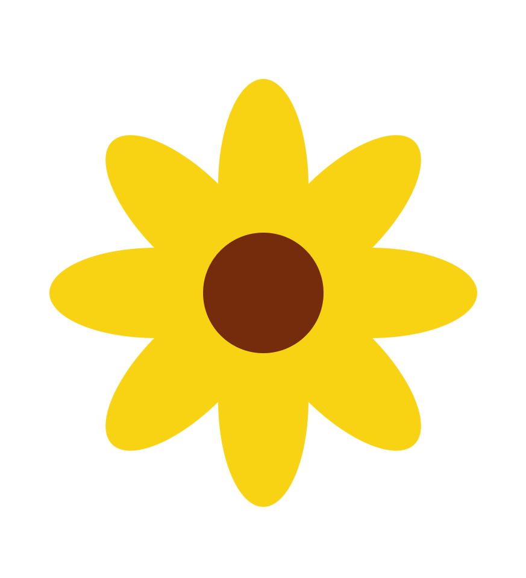
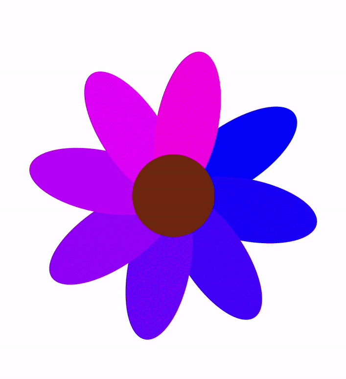
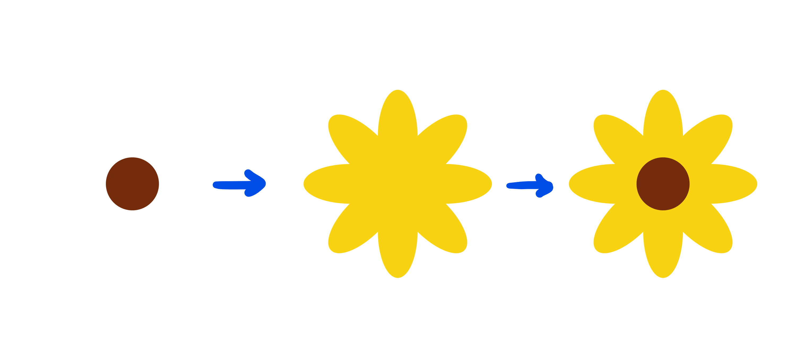
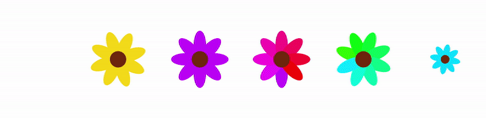

# animated garden 🌻🌼🌱🌷

an exploration of [compose animation](https://developer.android.com/jetpack/compose/animation) &amp; [compose multiplatform](https://www.jetbrains.com/lp/compose-multiplatform/) based on the "composable sheep" talk series

original "composable sheep" talks by nicole and tasha:

- [Composable Sheep: A Compose Animations Journey (droidcon NYC 2022)](https://www.droidcon.com/2022/08/01/composable-sheep-a-compose-animations-journey/)
- [Composable Sheep: The Creative Coding Epilogue (droidcon London 2022)](https://www.droidcon.com/2022/11/15/composable-sheep-the-creative-coding-epilogue/)

the source code from these talks was also used as a reference for this project:

- [nicole-terc/composable-sheep](https://github.com/nicole-terc/composable-sheep)
- [drinkthestars/composable-sheep-sketches: Funky composable sheep 😎 🐏](https://github.com/drinkthestars/composable-sheep-sketches)

## run it 🏃‍♀️

this project was built with [IntelliJ IDEA Community Edition](https://www.jetbrains.com/idea/download) version `2022.3.2`

the `Garden` app can be run on desktop 💻 or mobile 📱

> Note: on mobile, the `RuntimeShader` API requires Android 13 Tiramisu (SDK 33)

## project contents

this project (and the accompanying [blog series](https://devblogs.microsoft.com/surface-duo/)) covers the following:

| concept | exercise | example |
|:---:|:---:|:---:|
| custom graphics with `Canvas` | draw a sunflower |  |
| basic & complex compose animations | animate a sunflower |  |
| background shaders for desktop and mobile | grow a grassy background |  |

## draw a sunflower 🌻

learn to create custom graphics with `Canvas`

documentation: [Graphics In Compose](https://developer.android.com/jetpack/compose/graphics/draw/overview)

source code:

- [`drawSunflower`](https://github.com/khalp/animated-garden/blob/main/Garden/common/src/commonMain/kotlin/com/example/common/Sunflower.kt#L101)
- [`Sunflower`](https://github.com/khalp/animated-garden/blob/main/Garden/common/src/commonMain/kotlin/com/example/common/Sunflower.kt#L95)

## animate a sunflower 💫

familiarize yourself with compose animation APIs by animating different properties of the sunflower (size, angle, color...)

documentation:

- [Animations in Compose](https://developer.android.com/jetpack/compose/animation)
- [Customize animations](https://developer.android.com/jetpack/compose/animation/customize)

source code:

- [`AnimatedSizeSunflower`](https://github.com/khalp/animated-garden/blob/main/Garden/common/src/commonMain/kotlin/com/example/common/Sunflower.kt#L81)
- [`AnimatedRotationSunflower`](https://github.com/khalp/animated-garden/blob/main/Garden/common/src/commonMain/kotlin/com/example/common/Sunflower.kt#L70)
- [`AnimatedColorSunflower`](https://github.com/khalp/animated-garden/blob/main/Garden/common/src/commonMain/kotlin/com/example/common/Sunflower.kt#L59)
- [`AnimatedPetalColorSunflower`](https://github.com/khalp/animated-garden/blob/main/Garden/common/src/commonMain/kotlin/com/example/common/Sunflower.kt#L48)
- [`AnimatedPetalColorAndRotationSunflower`](https://github.com/khalp/animated-garden/blob/main/Garden/common/src/commonMain/kotlin/com/example/common/Sunflower.kt#L37)
- [`AnimatedEverythingSunflower`](https://github.com/khalp/animated-garden/blob/main/Garden/common/src/commonMain/kotlin/com/example/common/Sunflower.kt#L19)

## add a background shader 🕶️

learn how to implement background shaders on desktop and mobile

documentation:

- [Brush: Gradients and Shaders](https://developer.android.com/jetpack/compose/graphics/draw/brush)
- [Using AGSL in your Android app](https://developer.android.com/develop/ui/views/graphics/agsl/using-agsl)
- [SkSL & Runtime Effects](https://skia.org/docs/user/sksl/)

source code:

- [`greenGradient`](https://github.com/khalp/animated-garden/blob/main/Garden/common/src/commonMain/kotlin/com/example/common/App.kt#L21)
- [`complexGreen`](https://github.com/khalp/animated-garden/blob/main/Garden/common/src/commonMain/kotlin/com/example/common/App.kt#L40)
- [Android `RuntimeShader` setup](https://github.com/khalp/animated-garden/blob/main/Garden/android/src/main/java/com/example/android/MainActivity.kt#L22)
- [Desktop `RuntimeEffect` setup](https://github.com/khalp/animated-garden/blob/main/Garden/desktop/src/jvmMain/kotlin/Main.kt#L15)
